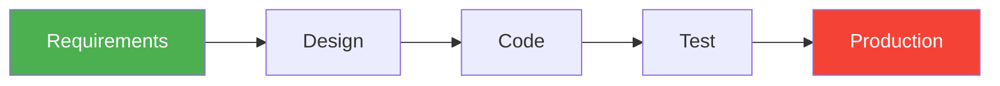

# Lecture 1 — DevSecOps Foundations: From "Add Security Later" to "Security Everywhere"

---

## Slide 1 – Equifax, 2017: the patch that was never applied

- March 7, 2017: Apache discloses CVE-2017-5638, a remote code execution bug in Struts 2, and ships the patch the same day.
- March 8: US-CERT notifies Equifax. March 9: Equifax security emails a patch directive to its administrators.
- March 10: attackers first exploit the bug on the ACIS dispute portal. A March 15 scan does not flag the portal, so it stays unpatched.
- May 13 to July 30: the attackers pull records on about 147 million people: names, birth dates, Social Security numbers, driver's licence numbers.
- July 29: Equifax renews a TLS-inspection certificate that had expired ten months earlier. Decrypted traffic becomes visible again and the breach is noticed within a day.
- Total cost to Equifax: about $1.4 billion in security spending and settlements, including a settlement of up to $700 million with the FTC, CFPB and US states.

> Think: the patch existed, the directive went out, the fix was free. What failed was the process between "we have a control" and "the control catches the bug". That gap is what this course is about.

---

## Slide 2 – Learning outcomes

By the end of this lecture you can:

1. Define DevSecOps and tell it apart from "DevOps plus a scanner".
2. Explain shift-left with the cost-of-defect argument, and say where the argument stops.
3. Name the OWASP Top 10:2025 categories and what changed since 2021.
4. Map three breaches (Equifax, Capital One, Log4Shell) to the practice that would have caught each.
5. Describe the pipeline you will have built by Lab 10.

---

## Slide 3 – Course map

```mermaid
graph LR
    L1["L1 Foundations"] --> L2["L2 Threat modeling"]
    L2 --> L3["L3 Secure Git"]
    L3 --> L4["L4 CI/CD + SBOM"]
    L4 --> L5["L5 SAST / DAST"]
    L5 --> L6["L6 IaC scanning"]
    L6 --> L7["L7 Containers + K8s"]
    L7 --> L8["L8 Supply chain"]
    L8 --> L9["L9 Runtime detection"]
    L9 --> L10["L10 Vuln management"]
    style L1 fill:#FF9800,color:#fff
    style L10 fill:#4CAF50,color:#fff
```



- Every lab targets the same application, OWASP Juice Shop. By Week 10 you will have run every defensive practice in the course against one attack surface.
- The order is the order of a software lifecycle: model, write, ship, scan, harden, sign, detect, triage.

---

## Slide 4 – The project: OWASP Juice Shop

- Created by Björn Kimminich in 2014, accepted as an OWASP project in 2016, now an OWASP Flagship project.
- The course pins v20.0.0 (May 2026). It ships 112 challenges in 16 categories: 16 Sensitive Data Exposure, 13 Injection, 12 Broken Access Control, 12 Improper Input Validation, 9 XSS, 9 Broken Authentication, and so on.
- Stack: Node.js, Angular, SQLite, JWT sessions, file uploads. The bugs are the kind found in production code, not `eval(user_input)` toys.
- The score board at `/#/score-board` is ground truth: when a scanner reports a finding in Lab 5, you can check whether it found a known challenge or noise.
- Lab 1 deploys it. Labs 4, 5, 7, 8 and 10 generate its SBOM, scan its code and its running instance, scan and sign its image, and triage everything in DefectDojo.

---

## Slide 5 – What DevSecOps is

- January 2012: Gartner analyst Neil MacDonald writes "DevOps Needs to Become DevOpsSec": security has to be built into DevOps workflows rather than bolted on.
- September 2016: Gartner publishes "DevSecOps: How to Seamlessly Integrate Security Into DevOps" (MacDonald and Head). Security is integrated at multiple points of the pipeline, "largely transparent to developers", without losing the speed of DevOps.
- Working definition for this course: security controls that run **as code, in the pipeline, at every stage, owned by the team that ships**.

| "DevOps plus a scanner" | DevSecOps |
|---|---|
| One tool, one stage, owned by the security team | Controls at commit, build, deploy and runtime |
| Findings emailed as a PDF | Findings fail the build or open a ticket with an owner |
| Security reviews the release | Security writes rules; developers fix in the PR |

- What DevSecOps is not: a product you buy, a security team that approves pipelines, an audit before launch.

---

## Slide 6 – Timeline

| Year | Milestone |
|---|---|
| 2001 | Manifesto for Agile Software Development, Snowbird, Utah. OWASP founded. |
| 2003 | First OWASP Top 10. |
| 2009 | First DevOpsDays in Ghent, organised by Patrick Debois; the word "DevOps" comes from the event name. |
| 2012 | Gartner: "DevOps Needs to Become DevOpsSec". |
| 2016 | Gartner DevSecOps report; Jim Bird, *DevOpsSec* (O'Reilly). |
| 2017 | Equifax breach. |
| 2019 | Capital One breach. |
| 2020 | SolarWinds Orion build compromise (CISA alert AA20-352A, December 2020). |
| 2021 | Log4Shell. |
| 2024 | NIST Cybersecurity Framework 2.0 adds the Govern function. |
| 2025 | OWASP Top 10:2025. |

---

## Slide 7 – A defect costs more the later you find it

- Barry Boehm, *Software Engineering Economics* (1981): on large projects, fixing a defect after delivery cost up to 100 times more than fixing it during requirements.
- Boehm and Basili, "Software Defect Reduction Top 10 List" (IEEE Computer, 2001): for small, non-critical systems the factor is closer to 5:1. The popular "10x per phase" is a slogan; the direction is what the data supports.
- NIST, *The Economic Impacts of Inadequate Infrastructure for Software Testing* (2002): software defects cost the US economy about $59.5 billion a year; better testing infrastructure could remove about $22.2 billion of that.



- DevSecOps in one sentence: run each check at the earliest point where it still produces a useful signal.

---

## Slide 8 – Shift-left, and where it stops

| Control | Where it moves to | Lab |
|---|---|---|
| Threat modeling | Design | 2 |
| Secret detection | Pre-commit hook | 3 |
| SBOM and dependency scan | Build | 4 |
| SAST | Pull request | 5 |
| IaC scanning | Pull request | 6 |
| Image scan, pod hardening | Image build, deploy | 7 |
| Signing and verification | Deploy gate | 8 |
| Runtime detection | Cluster | 9 |
| Triage, SLAs, metrics | Program | 10 |

- Shift-left does not mean only-left. Log4Shell (Slide 15) was unknown to every scanner until December 9, 2021; the teams that coped had runtime detection and an inventory, not a better SAST rule.
- Labs 9 and 10 exist because some bugs only show up in production.

---

## Slide 9 – Culture, process, tools

| Pillar | What it means | Without it |
|---|---|---|
| Culture | The team that ships owns the fix | Security becomes a queue; findings age |
| Process | Threat modeling, SLAs per severity, post-incident reviews | The same bug class ships every release |
| Tools | SAST, DAST, SCA, IaC and runtime checks in the pipeline | Quarterly PDF nobody reads |

- DORA, *Accelerate State of DevOps 2022* (33,000 respondents): the strongest predictor of adopting security practices is cultural, a high-trust, low-blame culture. Supply-chain security controls improved delivery performance, but only where continuous integration was already in place.
- This course spends ten weeks rather than three because the tools are the easy part.

---

## Slide 10 – CIA, plus two properties you will implement

| Property | Meaning | Where you build it |
|---|---|---|
| Confidentiality | Only authorised parties read the data | Lab 3 (no secrets in Git), Lab 11 (TLS) |
| Integrity | Only authorised parties change the data or the code | Lab 8 (signed images) |
| Availability | Authorised parties can reach the system | Lab 11 (rate limiting), Lab 12 (isolation) |
| Authenticity | The artifact comes from who it claims | Lab 8 (provenance attestations) |
| Non-repudiation | The author cannot deny the action | Lab 3 (signed commits) |

---

## Slide 11 – OWASP and the Top 10:2025

- OWASP, the Open Worldwide Application Security Project, is a non-profit founded in 2001. The Top 10 has been published in 2003, 2004, 2007, 2010, 2013, 2017, 2021 and 2025.
- The 2025 edition is built from data on more than 2.8 million applications contributed by 13 organisations. 589 CWEs were analysed; 248 of them map into the ten categories. Eight categories come from the data, two from the community survey.
- Changes since 2021:
  - A03 Software Supply Chain Failures widens the old A06 Vulnerable and Outdated Components to cover the whole build and distribution ecosystem.
  - A10 Mishandling of Exceptional Conditions is new: error paths that leak information or fail open.
  - Server-Side Request Forgery, its own category in 2021, is folded into A01 Broken Access Control.
  - A07 is renamed Authentication Failures; A09 is renamed Security Logging & Alerting Failures.

---

## Slide 12 – The list, and where the course meets each category

| # | Category | In plain terms | Labs |
|---|---|---|---|
| A01 | Broken Access Control | Users reach data or actions they should not, including SSRF | 2, 5 |
| A02 | Security Misconfiguration | Defaults, debug endpoints, missing headers, open buckets | 1, 6, 7 |
| A03 | Software Supply Chain Failures | Compromised or unverified dependencies, builds, distribution | 4, 8 |
| A04 | Cryptographic Failures | Weak or missing encryption, secrets in code | 3, 11 |
| A05 | Injection | Untrusted input executed as SQL, NoSQL, shell, LDAP | 5 |
| A06 | Insecure Design | The architecture invites the bug | 2 |
| A07 | Authentication Failures | Weak passwords, broken sessions, missing MFA | 5 |
| A08 | Software or Data Integrity Failures | Unsigned updates, unsafe deserialisation | 8 |
| A09 | Security Logging & Alerting Failures | Attacks nobody sees | 9 |
| A10 | Mishandling of Exceptional Conditions | Stack traces to users, fail-open error paths | 5, 10 |

- Lab 1 asks you to map three observed risks to these categories. Use this table and the OWASP page.

---

## Slide 13 – Why Injection is still on the list after twenty years

```python
# bad: string concatenation
def get_user(username):
    cursor.execute(f"SELECT * FROM users WHERE name = '{username}'")
    # input:  bob' OR '1'='1
    # query:  SELECT * FROM users WHERE name = 'bob' OR '1'='1'

# good: parameterised query
def get_user(username):
    cursor.execute("SELECT * FROM users WHERE name = ?", (username,))
```

- The fix is one line once you see it. The problem is that the first version looks fine until you think like an attacker.
- Juice Shop v20.0.0 has 13 Injection challenges (SQL and NoSQL). In Lab 5, Semgrep flags the vulnerable patterns in the source before you find them by hand.

---

## Slide 14 – Case study: Capital One, 2019

- A former AWS employee sent Server-Side Request Forgery requests through a misconfigured open-source web application firewall running on an EC2 instance. The WAF fetched the EC2 instance metadata service and returned the instance role's temporary credentials.
- Those credentials could list and read more than 700 S3 buckets. About 106 million credit applications were taken, including about 140,000 Social Security numbers and 80,000 bank account numbers.
- Consequences: an $80 million civil penalty from the OCC (2020), a $190 million class-action settlement, and a federal conviction for the attacker (2022).
- In course terms: an IaC scan (Lab 6) flags an instance role with wildcard S3 permissions; a threat model (Lab 2) marks the metadata service as a trust boundary; runtime detection (Lab 9) sees a WAF host suddenly reading S3. In OWASP Top 10:2025 numbering this is A01, since SSRF now lives there.

---

## Slide 15 – Case study: Log4Shell, 2021

- November 24, 2021: Chen Zhaojun of Alibaba Cloud reports CVE-2021-44228 to the Apache Logging project. December 6: a fix appears in 2.15.0-rc1. December 9: the bug is public and exploited within hours. CVSS 10.0.
- The bug: Log4j 2 resolves `${jndi:ldap://...}` inside a log message, so any logged user input can load and run remote code.
- Log4j is embedded in a large share of Java software, so the first question everywhere was "which of our services contain log4j-core, and which version?"
- In course terms: an SBOM (Lab 4) answers that question in minutes instead of days; dependency scanning (Lab 4) flags the vulnerable version; runtime detection (Lab 9) catches the outbound LDAP connection from a service that never makes one.

---

## Slide 16 – Secure SDLC: where each lab sits

| Phase | Practice | Labs |
|---|---|---|
| Requirements | Abuse cases, security stories | lecture only |
| Design | Threat modeling with STRIDE, trust boundaries | 2 |
| Implement | Signed commits, secret scanning | 3 |
| Verify | SBOM, SCA, SAST, DAST, IaC and image scanning, signing | 4 to 8 |
| Operate | Runtime detection, vulnerability management, metrics | 9, 10 |

- NIST SP 800-218, the Secure Software Development Framework, is the reference standard for this table; Lecture 9 returns to it.

---

## Slide 17 – Maturity models and roles

- OWASP SAMM (Software Assurance Maturity Model): 15 security practices, each scored at maturity level 1 (initial), 2 (structured, repeatable) or 3 (optimised, measured). Lecture 9 walks through it.
- BSIMM (Building Security In Maturity Model, Black Duck): an annual descriptive study of what real programs do, useful for benchmarking.
- Moving from level 1 to level 2 in SAMM terms means documenting what already happens and making it repeat every release, not buying a tool.

| Role | Owns | In this course |
|---|---|---|
| Developer | Writes code, fixes findings in the PR | every lab |
| DevOps / SRE | Pipeline, deploy hardening | 4, 7 |
| Security engineer | Detection rules, custom policies | 6, 9 |
| Security champion | A developer with security training, embedded in a product team, reviews PRs | lecture only |
| Security manager | SLAs, metrics, reporting | 10 |

- The OWASP Security Champions Guide describes how to start a champions program; it is the role that scales DevSecOps beyond the security team.

---

## Slide 18 – Five things you will hear at your first job

| Claim | What the evidence says |
|---|---|
| "Security slows us down" | DORA 2022: supply-chain security controls improved delivery performance where CI was in place |
| "We'll add security after the MVP" | Boehm: the later the fix, the higher the cost; the MVP becomes the legacy system |
| "We have a firewall" | Capital One had a WAF; the WAF was the entry point. Modern traffic is HTTPS through port 443 and the perimeter says nothing about the application |
| "The scanner shows zero criticals" | Scanners find known patterns; on December 8, 2021 every scanner showed zero Log4Shell findings |
| "That's the security team's problem" | Equifax security sent the directive; the team that ran the portal never saw it. Ownership sits with the team that runs the system |

---

## Slide 19 – Lab 1, next lecture, reading

Lab 1 this week:
- Task 1 (6 pts): run Juice Shop v20.0.0 on localhost, write a triage report, map three risks to the Top 10:2025.
- Task 2 (3 pts): a PR template your fork uses for every lab.
- Task 3 (1 pt): GitHub community engagement.
- Bonus (2 pts): a GitHub Actions smoke test of Juice Shop; a preview of Lecture 4.

Next week: Lecture 2, threat modeling with STRIDE and Threagile. Bring a diagram of any system you have worked on.

Books:
- Jim Bird, *DevOpsSec* (O'Reilly, 2016). Short, free, the clearest overview of the idea.
- Julien Vehent, *Securing DevOps* (Manning, 2018). A real pipeline at Mozilla, tool by tool.
- Kim, Humble, Debois, Willis, *The DevOps Handbook*, 2nd ed. (IT Revolution, 2021). The cultural foundation DevSecOps extends.
- Andrew Hoffman, *Web Application Security*, 2nd ed. (O'Reilly, 2024). Companion to the attacks Juice Shop contains.

Talks: Julien Vehent, "Beyond the Security Team" (DevSecCon Seattle, 2019); Vehent, "Tools & Techniques from Building a DevSecOps Culture at Mozilla" (SBA Live Academy, 2020).

> "Security is a process, not a product." Bruce Schneier, *Information Security Magazine*, April 2000.

---

## Sources

- Equifax timeline, root causes: US House Committee on Oversight, *The Equifax Data Breach* (Dec 2018), https://oversight.house.gov/wp-content/uploads/2018/12/Equifax-Report.pdf ; CSO Online FAQ, https://www.csoonline.com/article/567833/equifax-data-breach-faq-what-happened-who-was-affected-what-was-the-impact.html
- Equifax settlement (up to $700M): FTC, https://www.ftc.gov/enforcement/refunds/equifax-data-breach-settlement
- Gartner 2012 blog: https://blogs.gartner.com/neil_macdonald/2012/01/17/devops-needs-to-become-devopssec/ ; Gartner 2016 report: https://www.gartner.com/en/documents/3463417
- Jim Bird, *DevOpsSec*: https://www.oreilly.com/library/view/devopssec/9781491971413/
- Agile Manifesto history: https://agilemanifesto.org/history.html ; DevOpsDays Ghent 2009: https://devopsdays.org/events/2009-ghent/
- OWASP Top 10 project and editions: https://owasp.org/www-project-top-ten/ ; Top 10:2025 list and introduction (data figures, changes): https://owasp.org/Top10/2025/ , https://owasp.org/Top10/2025/0x00_2025-Introduction/
- NIST CSF 2.0: https://www.nist.gov/cyberframework ; SolarWinds, CISA AA20-352A: https://www.cisa.gov/news-events/cybersecurity-advisories/aa20-352a
- Boehm and Basili 2001: https://www.cs.umd.edu/projects/SoftEng/ESEG/papers/82.78.pdf ; NIST 2002 software testing study: https://www.rti.org/sites/default/files/resources/software_testing.pdf
- DORA 2022 report: https://dora.dev/research/2022/dora-report/
- Capital One: DOJ conviction release (2022), https://www.justice.gov/usao-wdwa/pr/former-seattle-tech-worker-convicted-wire-fraud-and-computer-intrusions ; OCC $80M penalty (2020), https://www.occ.gov/news-issuances/news-releases/2020/nr-occ-2020-101.html
- Log4Shell: Apache Logging security page, https://logging.apache.org/security.html ; CISA alert, https://www.cisa.gov/news-events/alerts/2021/12/10/apache-releases-log4j-version-2150-address-critical-rce-vulnerability ; Datadog timeline, https://www.datadoghq.com/blog/log4j-log4shell-vulnerability-overview-and-remediation/
- OWASP SAMM: https://owaspsamm.org/model/ ; BSIMM: https://www.blackduck.com/services/security-program/bsimm-maturity-model.html ; OWASP Security Champions Guide: https://owasp.org/www-project-security-champions-guidebook/
- NIST SSDF SP 800-218: https://csrc.nist.gov/Projects/ssdf
- Juice Shop project: https://owasp.org/www-project-juice-shop/ ; v20.0.0 release and challenge list: https://github.com/juice-shop/juice-shop/releases/tag/v20.0.0
- Books: https://www.manning.com/books/securing-devops , https://itrevolution.com/product/the-devops-handbook-second-edition/ , https://www.oreilly.com/library/view/web-application-security/9781098143923/
- Talks: http://jvehent.org/2019/09/30/beyond_the_security_team.html , https://www.slideshare.net/SBA-Research/tools-amp-techniques-building-a-dev-secops-culture-at-mozilla-sba-live-academy-may-2020-234913386
- Schneier, "The Process of Security" (2000): https://www.schneier.com/essays/archives/2000/04/the_process_of_secur.html
