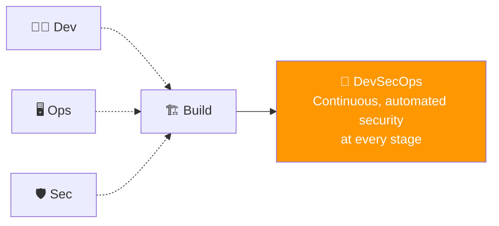
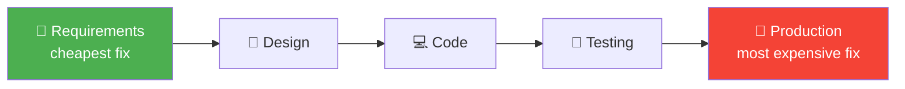
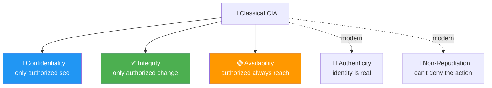
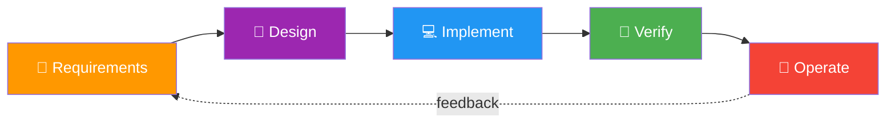

# 📌 Lecture 1 — DevSecOps Foundations: From "Add Security Later" to "Security Everywhere"

---

## 📍 Slide 1 – 💥 The $1.4 Billion Patch That Wasn't Applied

* 🗓️ **March 7, 2017** — Apache discloses **CVE-2017-5638**, an RCE in Struts 2. Patch ships **the same day**. CVSS 10.0
* 📧 March 9: Equifax's security team emails the patch directive across the company
* 🌀 The vulnerable web portal isn't on the inventory the directive used. **It is missed**
* 🗓️ **March 10**: someone is already exploiting it
* 💾 May 13 – July 30: **147 million records** exfiltrated — names, SSNs, birth dates, license numbers
* 🚨 July 29: Equifax discovers the breach. CEO and CISO resign within weeks
* 💰 Final cost: **~$1.4 billion** in remediation + settlements

> 🤔 **Think:** The patch existed. The directive went out. The fix was free. **What process failure cost a billion dollars?** That gap — between "we have a security control" and "the control actually catches the bug" — is what this course is about.

---

## 📍 Slide 2 – 🎯 Learning Outcomes (this lecture)

| # | 🎓 Outcome |
|---|-----------|
| 1 | ✅ Define DevSecOps and explain how it differs from "DevOps + a security tool" |
| 2 | ✅ Place the shift-left philosophy on a real cost-of-defect curve |
| 3 | ✅ Recite the **OWASP Top 10 (2025)** categories and what changed from 2021 |
| 4 | ✅ Walk through three real breaches (Equifax 2017, Capital One 2019, Log4Shell 2021) and identify which DevSecOps practice each one would have caught |
| 5 | ✅ Describe what your DevSecOps pipeline will look like by the end of the course |

---

## 📍 Slide 3 – 🗺️ Course Map: Where We're Going

```mermaid
graph LR
    L1["🏛️ L1 Foundations<br/>(this)"] --> L2["🎯 L2 Threat<br/>modeling"]
    L2 --> L3["🔐 L3 Secure<br/>Git"]
    L3 --> L4["🚀 L4 CI/CD<br/>security"]
    L4 --> L5["🧪 L5 SAST/<br/>DAST"]
    L5 --> L6["🏗️ L6 IaC<br/>scanning"]
    L6 --> L7["📦 L7 Container<br/>security"]
    L7 --> L8["🔏 L8 Supply<br/>chain"]
    L8 --> L9["📊 L9 Runtime +<br/>metrics"]
    L9 --> L10["🎯 L10 Vuln<br/>management"]

    style L1 fill:#FF9800,color:#fff
    style L10 fill:#4CAF50,color:#fff
```



* 🎯 **Through-line:** every lab targets **OWASP Juice Shop** — the most famously broken web app in the world. By Week 10 you'll have run every defensive practice against the same attack surface
* 🪜 **The arc:** culture → modeling → write secure code → ship secure code → scan secure code → secure infrastructure → secure containers → secure supply chain → detect at runtime → triage findings

---

## 📍 Slide 4 – 🍹 The Project: OWASP Juice Shop

* 🏗️ Created by **Björn Kimminich** in 2014; OWASP project since 2016, now an OWASP Flagship project
* 🐛 v20.0.0 ships **112 challenges** in 16 categories (13 Injection, 12 Broken Access Control, 16 Sensitive Data Exposure, ...)
* 🚢 Docker one-liner: `docker run -d -p 127.0.0.1:3000:3000 bkimminich/juice-shop:v20.0.0`
* 🎯 **Why Juice Shop is the canonical learning target:**
  * Realistic stack (Node.js, Angular, SQLite, JWT, file uploads)
  * Bugs are intentional but **realistic** — not "use eval(user_input)" toy examples
  * Has a known set of challenges — the score board at `/#/score-board` is ground truth for checking scanner output
* 🧪 Lab 1 deploys it; Labs 4, 5, 7, 8, 10 keep attacking it from different angles

> 🧠 Juice Shop is broken on purpose, but in the way production applications are broken: realistic stack, realistic bugs, documented answers to check your tools against

---

## 📍 Slide 5 – 🧭 What Is DevSecOps?



* 🧑‍🏫 **Origin:** January 2012, Gartner analyst **Neil MacDonald** writes *"DevOps Needs to Become DevOpsSec"*. September 2016, the Gartner report *DevSecOps: How to Seamlessly Integrate Security Into DevOps* (MacDonald & Head) fixes the name: security integrated at multiple points of the pipeline, *"largely transparent to developers"*, without losing DevOps speed
* 🪜 **DevOps + a SAST tool ≠ DevSecOps.** The defining shift is *cultural*: security is **everyone's job**, executed **as code**, **early** and **often**
* 📚 First book-length treatment: *"DevOpsSec"* by **Jim Bird** (O'Reilly, 2016)
* 🚫 **What DevSecOps is NOT:**
  * Not a tool you buy
  * Not "the security team approves the pipeline"
  * Not a one-time audit before launch

---

## 📍 Slide 6 – 🕰️ A 25-Year Timeline

| 🗓️ Year | 📍 Milestone |
|---|---|
| 2001 | Manifesto for Agile Software Development — Snowbird, UT. OWASP founded |
| 2009 | Patrick Debois coins **"DevOps"** at the first DevOpsDays (Ghent, BE) |
| 2003 | First OWASP Top 10 |
| 2012 | **Gartner** blog *DevOps Needs to Become DevOpsSec* — Neil MacDonald |
| 2016 | Gartner *DevSecOps* report; first book-length treatment — *DevOpsSec* (Jim Bird, O'Reilly) |
| 2017 | Equifax breach — DevSecOps becomes a boardroom topic |
| 2019 | Capital One breach — cloud misconfiguration joins the agenda |
| 2020 | SolarWinds — supply-chain security joins the agenda |
| 2021 | Log4Shell — runtime detection joins the agenda |
| 2024 | NIST CSF 2.0 adds the *Govern* function |
| 2025 | **OWASP Top 10:2025** published; supply-chain failures get their own category |

---

## 📍 Slide 7 – 💸 The Cost-of-Defect Curve

> 📖 Barry Boehm, *Software Engineering Economics* (Prentice Hall, **1981**): on large projects a defect fixed after delivery cost up to **100×** a requirements-phase fix. Boehm & Basili (*IEEE Computer*, 2001) put small, non-critical systems closer to **5:1**. The popular "10× per stage" is a slogan; the direction is what the data supports



* 📊 NIST, *The Economic Impacts of Inadequate Infrastructure for Software Testing* (2002): software defects cost the US about **$59.5 billion a year**; better testing infrastructure could remove about **$22.2 billion** of it
* 🎯 **DevSecOps in one diagram:** push every security check **as far left** as it will still produce useful signal

---

## 📍 Slide 8 – ⬅️ Shift-Left, Pragmatically

* 🪜 **Shift-Left** = run security checks earlier in the pipeline, where fixes are cheap
* ⚠️ But: *"shift-left" doesn't mean "**only** left"* — runtime threats still need runtime defense (Lecture 9)
* 🪛 **In this course:** every lab maps to a leftward shift of one specific control:

| 🛠️ Control | 📍 Where it shifts to | 🧪 Lab |
|---|---|---|
| Threat modeling | Design | L2 |
| Secret leak detection | Pre-commit | L3 |
| SAST | PR build | L5 |
| SCA / SBOM | Build | L4 |
| IaC scanning | PR build | L6 |
| Image scan | Image build | L7 |
| Signing/verification | Deploy gate | L8 |
| Runtime detection | Cluster | L9 |

* 🧠 The *opposite* of shift-left is "shift-right-only" = a SOC reading post-mortems. Both ends are valid; **the middle is where DevSecOps adds value**

---

## 📍 Slide 9 – 🪜 Three Pillars (Culture, Process, Tools)

| 🏛️ Pillar | 🎯 What it means | 🔥 What goes wrong without it |
|---|---|---|
| 👥 **Culture** | Shared accountability; "if a dev wrote it, a dev fixes it" | Security team becomes the bottleneck; devs throw work over the wall |
| 🛠️ **Process** | Threat modeling, defined SLAs, post-incident reviews | Heroics; same vulns ship every release |
| 🤖 **Tools** | Automated SAST/DAST/SCA/IaC/runtime in the pipeline | Manual scans = quarterly findings dump nobody reads |

* 🪜 **DORA, Accelerate State of DevOps 2022** (33,000 respondents): the strongest predictor of adopting security practices is a **high-trust, low-blame culture**; supply-chain security controls improved delivery performance only where continuous integration was already in place
* 🧪 *"Tools are necessary but not sufficient."* If we only taught tools this course would be 3 weeks long. **It's 10 weeks because process and culture matter more.**

---

## 📍 Slide 10 – 🔒 The CIA Triad — and Two Modern Additions



* 🏛️ **CIA Triad:** the classical model every security course starts from
* 🪪 **Authenticity** matters now because of phishing + AI-generated content
* 📜 **Non-Repudiation** matters now because of regulatory reporting (GDPR, HIPAA)
* 🧠 Lab 3 (signed commits) is the first non-repudiation control you'll deploy

---

## 📍 Slide 11 – 🏆 OWASP and the Top 10:2025

* 🌐 **OWASP** = Open Worldwide Application Security Project — community-driven non-profit, **founded 2001**
* 🏆 The **Top 10** is a periodic ranking of the most critical web app risks. Releases: **2003, 2004, 2007, 2010, 2013, 2017, 2021, 2025**
* 🆕 **OWASP Top 10:2025** — the 8th edition — built from data on **2.8 million+ applications** from 13 organisations: 589 CWEs analysed, 248 mapped into the ten categories; 8 categories come from the data, 2 from the community survey
* 🔄 **What's new vs 2021:**
  * 🆕 **A03: Software Supply Chain Failures** (widens 2021's A06 "Vulnerable and Outdated Components" to the whole build and distribution ecosystem)
  * 🆕 **A10: Mishandling of Exceptional Conditions**
  * 🪜 SSRF absorbed into **A01 Broken Access Control** (it was a category of its own in 2021)
  * ✏️ Renamed: A07 **Authentication Failures**, A09 **Security Logging & Alerting Failures**

---

## 📍 Slide 12 – 🔥 OWASP Top 10:2025 — The List

| # | 🏷️ Category | 🎯 Plain English |
|---|---|---|
| **A01** | Broken Access Control | Users do things they shouldn't be allowed to (now includes SSRF) |
| **A02** | Security Misconfiguration | Defaults, debug pages, missing headers, open S3 buckets |
| **A03** | **Software Supply Chain Failures** 🆕 | Compromised libs, builds, broken provenance |
| **A04** | Cryptographic Failures | Weak/missing encryption, hard-coded secrets |
| **A05** | Injection | SQL, NoSQL, command, LDAP — untrusted input as code |
| **A06** | Insecure Design | The *architecture* invites the bug |
| **A07** | Authentication Failures | Weak passwords, broken MFA, session fixation |
| **A08** | Software or Data Integrity Failures | Unsigned updates, unsafe deserialization |
| **A09** | Security Logging & Alerting Failures | Can't detect because we can't see |
| **A10** | **Mishandling of Exceptional Conditions** 🆕 | Error paths leak info, fail-open instead of fail-closed |

* 🧠 **Every lab in this course defends against at least one A0X category.** Worth bookmarking this slide

---

## 📍 Slide 13 – 💉 Why Injection Hasn't Left the Top 10 in 20 Years

```python
# ❌ Vulnerable — string concatenation
def get_user(username):
    cursor.execute(f"SELECT * FROM users WHERE name = '{username}'")
    # Input: bob' OR '1'='1
    # Becomes: SELECT * FROM users WHERE name = 'bob' OR '1'='1'

# ✅ Safe — parameterized query
def get_user(username):
    cursor.execute("SELECT * FROM users WHERE name = ?", (username,))
```

* 🧠 The fix is **trivial** when developers know it. The teaching problem is that **string concat looks fine** until you imagine an attacker
* 🪜 **Lab 5** (SAST with Semgrep) will catch this exact pattern automatically — your first concrete shift-left win
* 🎯 OWASP Juice Shop v20.0.0 ships **13 Injection challenges** (SQL and NoSQL); you'll find the vulnerable patterns with Semgrep before you find them by hand

---

## 📍 Slide 14 – 🔬 Case Study: Capital One (2019)

* 🗓️ **July 19, 2019** — Capital One learns that a former AWS employee has used **SSRF** through a **misconfigured WAF** on EC2 to read the instance metadata service and take the role's credentials
* 🪜 The WAF's IAM role had wildcard `s3:Get*` / `s3:List*` across **700+ buckets**
* 💾 Exfiltration: **106 million records**, 140,000 SSNs
* 💰 **$80M** OCC civil penalty (2020) + **$190M** class-action settlement; the attacker was convicted in 2022
* 🧠 **The lessons in DevSecOps terms:**
  * 🏗️ **IaC scan** (L6) would have flagged the wildcard IAM
  * 🎯 **Threat modeling** (L2) would have surfaced the metadata service as a trust boundary
  * 📊 **Runtime detection** (L9) on outbound S3 calls would have caught the exfiltration mid-flight

---

## 📍 Slide 15 – 🔬 Case Study: Log4Shell (2021)

* 🗓️ **November 24, 2021** — Alibaba security team discloses CVE-2021-44228 (CVSS 10.0) in **Log4j 2**
* 🌍 **Log4j is everywhere** — embedded in millions of Java apps, including Minecraft, iCloud, Steam, Tesla
* 🐛 The bug: log messages are interpreted as JNDI lookups → arbitrary code execution from a log line
* 🐍 December 9, 2021: PoC goes public. The internet rewrites Christmas plans
* 🧠 **In DevSecOps terms:**
  * 📋 **SBOM** (L4) — could you instantly say *"do my services depend on Log4j 2?"* Most companies couldn't on day one
  * 🔏 **Supply-chain signing** (L8) — verifying provenance doesn't fix vuln deps, but it lets you know *which exact version* you have, fast
  * 📊 **Runtime detection** (L9) — a service that never talks LDAP suddenly opening an outbound LDAP/JNDI connection is exactly the kind of event a runtime rule catches

> 🤔 **Think:** Log4Shell was a code-level bug, but every defense that worked was at a **higher** layer (SBOM, runtime detection). What does that tell you about defense-in-depth?

---

## 📍 Slide 16 – 🧩 Secure SDLC: The Five Phases



| 🪜 Phase | 🛡️ DevSecOps practice | 🧪 Lab |
|---|---|---|
| Requirements | Security stories, abuse cases | (Lecture-only) |
| Design | Threat modeling (STRIDE), data classification | **L2** |
| Implement | Signed commits, secret scanning, secure coding | **L3** |
| Verify | SAST, DAST, IaC scan, container scan, SBOM/SCA | **L4–L8** |
| Operate | Runtime detection, vuln management, metrics | **L9–L10** |

* 🪜 **The whole point of this course is that practice goes in each phase** — by Week 10 you'll have something running in every one

---

## 📍 Slide 17 – 🪜 Maturity Models — Where You'll End Up

* 🏛️ **OWASP SAMM** — *Software Assurance Maturity Model* — 15 practices, each scored at maturity 1 (initial), 2 (structured, repeatable) or 3 (optimised, measured). We'll do a proper walkthrough in Lecture 9
* 📊 **BSIMM** — *Building Security In Maturity Model* (Black Duck) — descriptive annual study of what real programs do; useful for benchmarking
* 🪜 Moving from level 1 to level 2 means **documenting what already happens and making it repeat every release**, not buying a tool
* 🎯 **End-of-course goal:** every student should be able to **describe a Level 2 program** and identify *one concrete gap* to push their team toward Level 3 — this is exam-territory material

---

## 📍 Slide 18 – 🏢 Roles in a DevSecOps Team

| 🧑‍💼 Role | 🎯 Responsibility | 👀 Where you meet them in the course |
|---|---|---|
| 👩‍💻 **Developer** | Writes code, runs SAST locally, fixes findings | Every lab |
| 🚀 **DevOps/SRE** | Maintains the pipeline; deploys hardening | L4, L7 |
| 🛡️ **Security Engineer** | Writes detection rules, custom policies | L6, L9 |
| 🦸 **Security Champion** | Developer trained in security; embeds in dev teams | Lecture-only |
| 🎯 **Security Architect** | Designs trust boundaries, signs off threat models | L2 |
| 📊 **Security Manager** | Owns metrics, SLAs, exec reporting | L10 |

* 🪜 **"Security Champion" is the role that scales DevSecOps in real orgs** — one developer per team trained to push back on PRs that ship vulnerable code. Read the OWASP Security Champions Guide when you have a quiet hour

---

## 📍 Slide 19 – 🚫 The Five Myths You'll Hear at Your First Job

| 😱 Myth | 🧠 Reality |
|---|---|
| *"Security slows us down"* | DORA 2022: supply-chain security controls **improved** delivery performance where CI was already in place |
| *"We'll do security after MVP"* | The MVP becomes the legacy system; Boehm's curve says every month of delay makes the fix dearer |
| *"We have a firewall"* | Modern apps speak HTTPS through firewalls; perimeter security is a 1990s mental model |
| *"Our scanner shows 0 critical, so we're secure"* | Scanners find *known* bugs. Your unknowns are your unknowns. (Threat modeling, L2) |
| *"That's the security team's problem"* | The security team can't be in every PR. Distributed ownership is the only model that scales |

* 🧠 You'll hear at least three of these in the first month of any real DevSecOps job. The point of this course is to give you the data + stories to push back without sounding theoretical

---

## 📍 Slide 20 – 📚 Resources & What's Next

**Books to keep on your desk:**

| 📖 Book | ✍️ Why |
|---|---|
| *DevOpsSec* — Jim Bird (O'Reilly, 2016, free report) | Still the most accessible DevSecOps overview |
| *Securing DevOps* — Julien Vehent (Manning, 2018) | A real pipeline at Mozilla, tool by tool |
| *The DevOps Handbook* — Kim, Humble, Debois, Willis (2nd ed., 2021) | The DevOps cultural foundation that DevSecOps extends |
| *Web Application Security* — Andrew Hoffman (2nd ed., O'Reilly, 2024) | Companion to the attacks Juice Shop contains |

**Talks (1–2 hours, worth your time):**

* 🎥 *"Beyond the Security Team"* — Julien Vehent, DevSecCon Seattle 2019
* 🎥 *"Tools & Techniques from Building a DevSecOps Culture at Mozilla"* — Julien Vehent, SBA Live Academy 2020

**Standards & specs (bookmark them):**

* 📜 [OWASP Top 10:2025](https://owasp.org/Top10/2025/)
* 📜 [OWASP Juice Shop](https://owasp.org/www-project-juice-shop/)
* 📜 [NIST SSDF (SP 800-218)](https://csrc.nist.gov/Projects/ssdf) — the canonical secure-SDLC standard

**Next week:** Lecture 2 — **Threat Modeling with STRIDE and Threagile**. Bring a system diagram of any app you've worked on; we'll model it.

> 💬 *"Security is a process, not a product."* — Bruce Schneier, *Information Security Magazine*, April 2000 — and still true 26 years later.

---

## 📚 Sources

- Equifax timeline and root causes: US House Committee on Oversight, *The Equifax Data Breach* (Dec 2018), https://oversight.house.gov/wp-content/uploads/2018/12/Equifax-Report.pdf ; CSO Online FAQ, https://www.csoonline.com/article/567833/equifax-data-breach-faq-what-happened-who-was-affected-what-was-the-impact.html ; FTC settlement, https://www.ftc.gov/enforcement/refunds/equifax-data-breach-settlement
- Gartner 2012 blog: https://blogs.gartner.com/neil_macdonald/2012/01/17/devops-needs-to-become-devopssec/ ; Gartner 2016 report: https://www.gartner.com/en/documents/3463417 ; Jim Bird, *DevOpsSec*: https://www.oreilly.com/library/view/devopssec/9781491971413/
- Agile Manifesto history: https://agilemanifesto.org/history.html ; DevOpsDays Ghent 2009: https://devopsdays.org/events/2009-ghent/ ; NIST CSF 2.0: https://www.nist.gov/cyberframework ; SolarWinds, CISA AA20-352A: https://www.cisa.gov/news-events/cybersecurity-advisories/aa20-352a
- Boehm & Basili 2001: https://www.cs.umd.edu/projects/SoftEng/ESEG/papers/82.78.pdf ; NIST 2002 software testing study: https://www.rti.org/sites/default/files/resources/software_testing.pdf
- DORA 2022 report: https://dora.dev/research/2022/dora-report/
- OWASP Top 10 project and editions: https://owasp.org/www-project-top-ten/ ; Top 10:2025 list and introduction (data figures, changes): https://owasp.org/Top10/2025/ , https://owasp.org/Top10/2025/0x00_2025-Introduction/
- Capital One: DOJ conviction release (2022), https://www.justice.gov/usao-wdwa/pr/former-seattle-tech-worker-convicted-wire-fraud-and-computer-intrusions ; OCC $80M penalty (2020), https://www.occ.gov/news-issuances/news-releases/2020/nr-occ-2020-101.html
- Log4Shell: Apache Logging security page, https://logging.apache.org/security.html ; CISA alert, https://www.cisa.gov/news-events/alerts/2021/12/10/apache-releases-log4j-version-2150-address-critical-rce-vulnerability ; Datadog timeline, https://www.datadoghq.com/blog/log4j-log4shell-vulnerability-overview-and-remediation/
- OWASP SAMM: https://owaspsamm.org/model/ ; BSIMM: https://www.blackduck.com/services/security-program/bsimm-maturity-model.html ; OWASP Security Champions Guide: https://owasp.org/www-project-security-champions-guidebook/ ; NIST SSDF: https://csrc.nist.gov/Projects/ssdf
- Juice Shop project: https://owasp.org/www-project-juice-shop/ ; v20.0.0 release and challenge list: https://github.com/juice-shop/juice-shop/releases/tag/v20.0.0
- Books: https://www.manning.com/books/securing-devops , https://itrevolution.com/product/the-devops-handbook-second-edition/ , https://www.oreilly.com/library/view/web-application-security/9781098143923/
- Talks: http://jvehent.org/2019/09/30/beyond_the_security_team.html , https://www.slideshare.net/SBA-Research/tools-amp-techniques-building-a-dev-secops-culture-at-mozilla-sba-live-academy-may-2020-234913386
- Schneier, "The Process of Security" (2000): https://www.schneier.com/essays/archives/2000/04/the_process_of_secur.html
