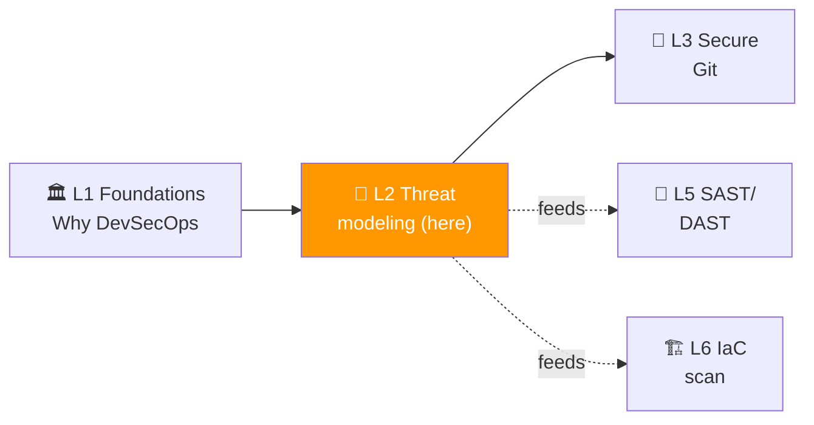
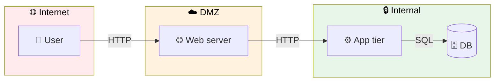
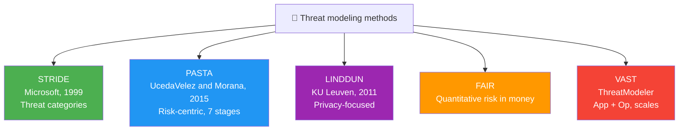

# 📌 Lecture 2 — Threat Modeling: STRIDE, DFDs, and Threagile

---

## 📍 Slide 1 – 🪟 The Pre-Mortem That Costs $0

* 🏗️ You can't scan code that doesn't exist yet
* 🎯 At the **design** stage, the cheapest bug fix is "we won't build it that way" — but you have to **see** the bug first
* 🎭 **Threat modeling** = a structured pre-mortem where you and your team enumerate how your system can be attacked, **before** you ship the design to anyone with a keyboard
* 💸 Recall Boehm's curve from Lecture 1: the later a defect is found, the dearer it is, and design is the earliest stage there is. Threat modeling is the only control in this course that runs before a line of code exists

> 💬 *"What's your threat model?"* — the question that separates a security discussion from a security argument. Without it, "is this secure?" has no answer

> 🤔 **Think:** Lecture 1 covered Equifax, Capital One, Log4Shell. Pick one — what would the **design-stage** conversation have flagged? (Spoiler: all three.)

---

## 📍 Slide 2 – 🎯 Learning Outcomes

| # | 🎓 Outcome |
|---|-----------|
| 1 | ✅ Draw a Level-1 Data Flow Diagram (DFD) for a small web app, with trust boundaries |
| 2 | ✅ Apply **STRIDE** to each DFD element and produce a ranked threat list |
| 3 | ✅ Recognize when STRIDE is the wrong tool (and which others fit) |
| 4 | ✅ Model a system declaratively in **Threagile** YAML and read the generated risk report |
| 5 | ✅ Identify three Threagile risk rules likely to fire on a typical web app |

---

## 📍 Slide 3 – 🗺️ Where Lecture 2 Sits



* 🪜 **Building on L1:** Lecture 1 mapped breaches to OWASP categories; this lecture explains how to discover those categories **on your own system**, before any code is written
* 🎯 **Lab 2 alignment:** model a sample web architecture in Threagile, then create a **secure variant** with HTTPS + encrypted DB, and compare the risk reports

---

## 📍 Slide 4 – 🏛️ What Threat Modeling Actually Is

Adam Shostack's *Threat Modeling: Designing for Security* (Wiley, 2014) frames the whole practice as four questions. The 2020 **Threat Modeling Manifesto**, written by fifteen practitioners including Shostack, adopts the same four:

| # | ❓ Question | 📦 Output |
|---|---|---|
| 1 | **What are we building?** | DFD / architecture sketch |
| 2 | **What can go wrong?** | Threat list (STRIDE-driven) |
| 3 | **What are we going to do about it?** | Mitigation list, ranked |
| 4 | **Did we do a good job?** | Re-review at design changes |

* 🎯 The four questions are framework-agnostic — STRIDE, PASTA, LINDDUN all answer them differently
* 🧠 **Threat modeling is a team activity, not a deliverable.** The output document is a byproduct; the **conversation** between dev/ops/sec is the value

---

## 📍 Slide 5 – 🧱 Trust Boundaries: The Core Idea



* 🪪 A **trust boundary** is a line across which data or authority flows between actors of **different trust levels**
* 🚦 Every arrow crossing a boundary is a threat candidate. The arrows *inside* a boundary you can usually ignore (you've already trusted that zone)
* 🎯 In Lab 2 you'll model exactly this kind of three-zone diagram and let Threagile enumerate the threats per arrow

---

## 📍 Slide 6 – 📊 DFDs in Five Symbols

| 🖼️ Symbol | 🏷️ Element | 🎯 What it represents |
|---|---|---|
| ⬛ Square | **External entity** | Users, third-party APIs — anything you don't own |
| ⭕ Circle | **Process** | Code that does work (your microservice) |
| 🛢️ Two-line cylinder | **Data store** | Databases, queues, file shares |
| ➡️ Arrow | **Data flow** | Direction of data movement |
| ✂️ Dashed line | **Trust boundary** | Crosses change trust level |

* 🏛️ DFDs come from 1970s structured analysis: the notation was proposed by **Larry Constantine** and popularised by **Tom DeMarco**'s *Structured Analysis and System Specification* (Yourdon Press, 1978), two decades before anyone used it for threats
* 🪜 **Level 0** = single-circle "context diagram"; **Level 1** = subsystems exposed; **Level 2+** = per-subsystem internals. For threat modeling, **Level 1 is usually the right zoom**

---

## 📍 Slide 7 – 🎯 STRIDE — The Core Method

* 🗓️ **Loren Kohnfelder and Praerit Garg**, Microsoft, **1 April 1999**, in an internal paper called *The Threats to Our Products*. It was the first method that told engineers **how to look** for threats instead of listing known ones
* 📖 Each letter is a threat **category** mapped to a security **property**

| 🔤 Letter | 🚨 Threat | 🛡️ Property violated | 💡 Example |
|---|---|---|---|
| **S** | Spoofing identity | Authentication | Attacker logs in as another user via stolen token |
| **T** | Tampering with data | Integrity | SQL injection alters records |
| **R** | Repudiation | Non-repudiation | User denies they made a transaction; no audit log |
| **I** | Information disclosure | Confidentiality | Stack trace leaks DB schema to user |
| **D** | Denial of service | Availability | Slowloris exhausts thread pool |
| **E** | Elevation of privilege | Authorization | User accesses admin endpoint due to missing check |

* 🧠 **Trick:** STRIDE pairs cleanly with **CIA + A + NR** from Lecture 1. The two frameworks are isomorphic — STRIDE is "which property is at risk?"; CIA is "what does the property protect?"

---

## 📍 Slide 8 – 🎬 STRIDE Applied to One Arrow

A login flow: `Browser → /api/login → user_db`

| 🔤 STRIDE | ❓ Question | 🛡️ Mitigation candidate |
|---|---|---|
| **S** | Could an attacker spoof the user's session? | TLS, secure cookies, MFA |
| **T** | Can the request body be tampered in transit? | TLS, request signing |
| **R** | If the user denies logging in, is there proof? | Auth audit log, IP + UA capture |
| **I** | Does the response leak whether the email exists? | Generic "invalid credentials" message |
| **D** | Can someone exhaust the login endpoint? | Rate limiting, captcha after N failures |
| **E** | Can a normal user reach admin login by changing a URL? | Server-side role check, not client-side |

* 🪜 **For one arrow, you get six threat candidates.** A typical Level-1 DFD has 5–10 arrows. **30–60 threats** is normal — that's why you need ranking, which we'll cover with Threagile

---

## 📍 Slide 9 – 🎲 STRIDE Is Not the Only Game in Town



| 🎯 Method | 🪜 Good for | 🚫 Skip when |
|---|---|---|
| **STRIDE** | Most web/API apps (this course) | Pure data-processing pipelines |
| **PASTA** | Risk-based programs, regulated industries | You don't have 7 stages of patience |
| **LINDDUN** | Privacy-sensitive systems (GDPR scope) | No personal data |
| **FAIR** | Talking to execs in dollar terms | Engineering-only conversations |
| **VAST** | Very large estates (100+ services) | Single product team |

* 🧠 **In this course we standardize on STRIDE + Threagile** — STRIDE because it's the most teachable, Threagile because it makes STRIDE actually executable in a pipeline

---

## 📍 Slide 10 – ⚙️ Threagile: STRIDE That Runs in CI

* 🏢 Created by **Christian Schneider**; released **4 August 2020** at Black Hat USA Arsenal and DEF CON 28 AppSec Village, MIT licence
* 🐹 Written in Go; latest release is **v0.9.1** (July 2024), which is what Lab 2 pins. The binary inside reports itself as 1.0.0
* 📜 You describe the system in a YAML file: assets, communication links, trust boundaries, data assets
* 🤖 Threagile runs ~50 built-in **risk rules** and outputs PDF + Excel + JSON reports with **scored risks**, mapped to STRIDE
* 🪜 Crucial property: **the model is version-controlled**, **diffable**, **runnable in CI** — you can fail a PR if a new high-severity threat appears

```bash
# ✅ Lab 2 runs exactly this. The output directory must exist first
mkdir -p output
docker run --rm -v "$PWD":/app/work threagile/threagile:0.9.1 \
  -model /app/work/threagile-model.yaml \
  -output /app/work/output
```

---

## 📍 Slide 11 – 📜 A Threagile Model, Annotated

```yaml
technical_assets:
  Web Application:
    type: process
    technology: web-application
    usage: business
    machine: container
    encryption: none                       # 🚨 will trigger risk
    owner: AppTeam
    confidentiality: confidential
    integrity: important
    availability: important
    multi_tenant: false
    redundant: false
    custom_developed_parts: true
    data_assets_processed: [Customer Records]
    data_assets_stored: []
    communication_links:
      DB Connection:
        target: User Database
        protocol: jdbc                     # 🚨 plain JDBC, not jdbc-encrypted
        authentication: credentials
        authorization: technical-user
        usage: business
        data_assets_sent: [Customer Records]
        data_assets_received: [Customer Records]
```

| 🏷️ Key field | 🎯 Why it matters |
|---|---|
| `encryption: none` | Triggers `unencrypted-asset` risk |
| `protocol: jdbc` (not `jdbc-encrypted`) | Triggers `unencrypted-communication-link` risk |
| `confidentiality: confidential` | Boosts severity score |

* 🧠 The lab is *exactly* this kind of edit-and-rescan cycle — minimal YAML, real reports

---

## 📍 Slide 12 – 🧮 Threagile Rules You'll See in Lab 2

Selected from Threagile's ~50 built-in rules:

| 🚨 Rule ID | 🎯 What it detects |
|---|---|
| `unencrypted-communication` | Link whose protocol is not an encrypted one |
| `unencrypted-asset` | Asset storing data without encryption |
| `missing-authentication` | Link into a sensitive asset with no authentication |
| `cross-site-scripting` | Web frontend able to render untrusted content |
| `server-side-request-forgery` | Asset making outbound calls on someone else's behalf |
| `missing-vault` | Secrets with no vault asset anywhere in the model |
| `container-baseimage-backdooring` | Container built from an unverified base image |
| `missing-build-infrastructure` | No build pipeline modelled at all |

* 🪜 **Task 2 in Lab 2** asks you to model a *secure variant* and **diff the reports**. On the shipped model the baseline is **23 risks: 4 elevated, 14 medium, 5 low, none critical or high**. Encrypting both links and both stores removes exactly three rule classes and lands at **18**. Note what that means: hardening the transport removed a fifth of the list, and the rest is design and process work

---

## 📍 Slide 13 – ⚖️ Rapid vs Deep Threat Modeling

| 🪜 Mode | ⏱️ Time | 🎯 Best for |
|---|---|---|
| **Whiteboard / shostack-4-questions** | 30 min | Sprint planning, new feature design |
| **Threagile YAML** | 2-4 hours | Service-level architecture review |
| **Full PASTA / SAMM-aligned** | Days | Annual program review, regulated systems |

* 🪜 The biggest mistake new teams make: trying to do "perfect" threat modeling and then never doing it again. **A 30-minute model done quarterly beats a 30-page model done once**
* 🧠 *"The best threat model is the one your team will actually run."* — Izar Tarandach, *Threat Modeling: A Practical Guide* (O'Reilly, 2021)

---

## 📍 Slide 14 – 🏛️ The Microsoft Threat Modeling Tool

* 🆓 Free GUI tool from Microsoft (Windows only, supported on Linux via Wine)
* 🪜 First released in 2003 as part of the **Microsoft SDL** (Security Development Lifecycle)
* 🖼️ Drag-and-drop DFD editor; auto-generates STRIDE threats per element
* ⚠️ **Limitations:** GUI-only (no `git diff`), no CI integration, slow on large systems
* 🆚 **Threagile vs MS-TMT trade-off:**
  * **MS-TMT** is friendlier for first-timers and brainstorming
  * **Threagile** is what fits in DevSecOps because it's text + executable

* 🪜 Use MS-TMT in a workshop to **discover** threats, then transcribe to Threagile for **continuous** verification

---

## 📍 Slide 15 – 🔬 Case Study: The Trust Boundary Nobody Modelled (2025)

**Salesloft Drift, August 2025.** Drift is a chat product that integrates with Salesforce. To do its job it holds OAuth access and refresh tokens for its customers' Salesforce tenants.

* 🗓️ **8-18 August 2025:** an attacker tracked as UNC6395 uses stolen Drift OAuth tokens to authenticate to customer Salesforce instances and run bulk SOQL queries through the API
* 🌍 Google's threat intelligence team reports **more than 700 organisations** potentially affected; Salesloft and Salesforce revoke every Drift token and take the integration offline
* 🎯 What the attacker was after: credentials sitting inside CRM records — AWS keys, Snowflake tokens, passwords
* 🪜 **In STRIDE terms:** **S** (a valid token used by the wrong party) and **I** (bulk disclosure). Nothing was "exploited" in the CVE sense: the integration worked exactly as designed
* 🧠 **The design-stage question that would have surfaced it:** *what can this third-party integration's token reach, who can revoke it, and would we see it being used at 3 a.m.?* An integration is an arrow crossing a trust boundary, drawn by a vendor rather than by you

> 🤔 **Think:** in Lab 2 the shipped model has exactly one arrow like this — the outbound webhook. What does Threagile say about it?

---

## 📍 Slide 16 – 🚨 Case Study: When Nobody Asked "Who Can Reach This?"

**Tesla, February 2018.** Researchers at RedLock find a Kubernetes administration console belonging to Tesla, running on AWS, with no password on it.

* 🪜 Inside the console: credentials for Tesla's AWS environment, including an S3 bucket with vehicle telemetry
* ⛏️ Attackers were already there, running cryptomining inside a Tesla pod, hiding behind their own mining pool and a Cloudflare-proxied endpoint on a non-standard port
* 🤔 **In STRIDE terms:** **S** (no authentication at all) plus **E** (the admin plane is the highest privilege in the cluster)
* 🪜 A thirty-minute session asking *"who can reach the admin dashboard, and from where?"* surfaces this before the console is ever exposed. This is the cheapest question in the course
* 🧠 The general shape: scanners find this only once it is live and reachable. A model finds it while it is still a diagram

## 📍 Slide 17 – 🧠 When You'll Throw the Model Away

* 🪜 Threat models **decay** as the system changes. Re-run them:
  * ✅ At every major design change (new service, new data flow, new auth scheme)
  * ✅ When the threat landscape shifts (post-Log4Shell: every dep was suddenly a supply-chain concern)
  * ✅ Quarterly, even if nothing changed (the world moves)
* ⚠️ **Don't:** version-pin a threat model once and forget it. A 3-year-old threat model is roughly as useful as a 3-year-old vuln scan
* 🎯 **In CI:** treat the Threagile YAML like any other code artifact — PR review, lint, model-diff in the PR description

---

## 📍 Slide 18 – 🪜 Building the Habit in Your Team

* 🧪 **A pattern that works:**
  1. **Design doc template** has a "Threat Model" section that **must be filled** before architectural review
  2. **Security Champion** (from Lecture 1) sits in on the design review and asks STRIDE prompts
  3. **Threagile YAML** lives in the service repo next to `docker-compose.yaml`
  4. **CI fails the PR** if a new high+critical threat appears without a mitigation field
* 🚫 **Anti-patterns:**
  * Quarterly "threat modeling day" where security team alone does it
  * One model per company, not per service
  * Output is a PDF in SharePoint that nobody opens

---

## 📍 Slide 19 – ⏭️ What's Next + What You'll Do

* 🧪 **Lab 2** (this week):
  * Task 1 (6 pts): run Threagile on the shipped Juice Shop model, rank the risks, map the top five to STRIDE letters
  * Task 2 (4 pts): harden the model, re-run, and account for what the diff did **and did not** remove
  * Bonus (2 pts): build a second model of the authentication flow from a stub, and find risks the architecture model could not see
* 🚀 **Lecture 3** (next week): **Secure Git** — signed commits, secret scanning, history rewriting. This is where you start *implementing* the controls that threat models keep recommending
* 🎯 Threat modeling will feed:
  * **Lab 5 (SAST/DAST)** — what to focus the scan on
  * **Lab 6 (IaC)** — which IAM/network risks to prioritize
  * **Lab 9 (Runtime)** — which behaviors to detect Falco rules for

---

## 📍 Slide 20 – 📚 Resources & Takeaways

**Books (one each on threat modeling):**

| 📖 Book | ✍️ Why |
|---|---|
| *Threat Modeling: Designing for Security* — Adam Shostack (Wiley, 2014) | The canonical book; ch. 3 covers STRIDE in depth |
| *Threat Modeling: A Practical Guide for Development Teams* — Izar Tarandach & Matthew Coles (O'Reilly, 2021) | Modern, agile-aligned; pairs perfectly with Threagile |
| *Securing Systems* — Brook Schoenfield (CRC Press, 2015) | Architectural risk analysis for senior engineers; harder read |

**Talks & specs:**

* 🎥 *"Threagile: Agile Threat Modeling with Open-Source Tools"* — Christian Schneider, DEF CON 28 AppSec Village (2020), [slides](https://christian-schneider.net/slides/DEF-CON-2020-Threagile.pdf)
* 📜 [Threat Modeling Manifesto](https://www.threatmodelingmanifesto.org/) (2020) — values, principles and anti-patterns, agreed by fifteen practitioners
* 📜 [OWASP Threat Modeling Cheat Sheet](https://cheatsheetseries.owasp.org/cheatsheets/Threat_Modeling_Cheat_Sheet.html)
* 📜 [Threagile Risk Rules Reference](https://threagile.io/docs/risks/) — every built-in rule
* 📜 [Microsoft SDL Threat Modeling page](https://www.microsoft.com/en-us/securityengineering/sdl/threatmodeling)

**Takeaways:**

| # | 🧠 Insight |
|---|---|
| 1 | A design-stage threat is the cheapest threat to fix. Threat modeling is a $0 cost for double-digit ROI. |
| 2 | STRIDE pairs with CIA+A+NR — they're two views of the same property set. |
| 3 | Trust boundaries are the only arrows you need to scrutinize. Everything in one zone is "trusted by definition." |
| 4 | A 30-minute model done quarterly beats a 30-page model done once. |
| 5 | Threagile makes threat modeling **diffable** and **runnable in CI** — that's how it scales past a single workshop. |
| 6 | Hardening a model removes the risks you declared away, not the ones you have to build for. Lab 2 shows a fifth of the list going, and the rest staying. |

> 💬 *"All models are wrong, but some are useful."* — George Box (1976) — applies to threat models exactly as much as to weather forecasts.

---

## 📚 Sources

- STRIDE origin, Kohnfelder and Garg, *The Threats to Our Products* (1 April 1999), the paper itself: https://adam.shostack.org/microsoft/The-Threats-To-Our-Products.docx ; history: https://www.darkreading.com/20-years-of-stride-looking-back-looking-forward/a/d-id/1334275
- Shostack's four questions and the Threat Modeling Manifesto (2020): https://www.threatmodelingmanifesto.org/ , https://shostack.org/blog/threat-modeling-manifesto/
- Data flow diagrams, structured analysis origin: https://en.wikipedia.org/wiki/Data-flow_diagram ; DeMarco, *Structured Analysis and System Specification* (Yourdon Press, 1978): https://archive.org/details/structuredanalys0000dema
- LINDDUN, KU Leuven: https://linddun.org/publications/ ; PASTA, UcedaVelez and Morana, *Risk Centric Threat Modeling* (Wiley, 2015): https://www.wiley.com/en-us/Risk+Centric+Threat+Modeling-p-9780470500965
- Threagile: repository and MIT licence, https://github.com/Threagile/threagile ; v0.9.1 release (July 2024), https://github.com/Threagile/threagile/releases ; launch coverage, https://portswigger.net/daily-swig/black-hat-2020-threagile-toolkit-enables-code-driven-threat-modeling ; DEF CON 28 slides, https://christian-schneider.net/slides/DEF-CON-2020-Threagile.pdf
- Rule IDs and risk counts: produced by `threagile/threagile:0.9.1 -list-risk-rules` and by running the shipped `labs/lab2/threagile-model.yaml` on 2026-09-05
- Salesloft Drift / UNC6395 (August 2025): https://cloud.google.com/blog/topics/threat-intelligence/data-theft-salesforce-instances-via-salesloft-drift , https://thehackernews.com/2025/09/salesloft-takes-drift-offline-after.html
- Tesla Kubernetes console (February 2018), RedLock: https://cyberscoop.com/tesla-cryptomining-redlock-cloud-breach/ , https://www.cnbc.com/2018/02/21/hackers-hijack-teslas-cloud-system-to-mine-cryptocurrency-redlock.html
- Microsoft SDL and *Threat Modeling* (Swiderski and Snyder, Microsoft Press, 2004): https://learn.microsoft.com/en-us/previous-versions/ms995349(v=msdn.10)
- Box, "Science and Statistics" (JASA, 1976): https://www-sop.inria.fr/members/Ian.Jermyn/philosophy/writings/Boxonmaths.pdf
